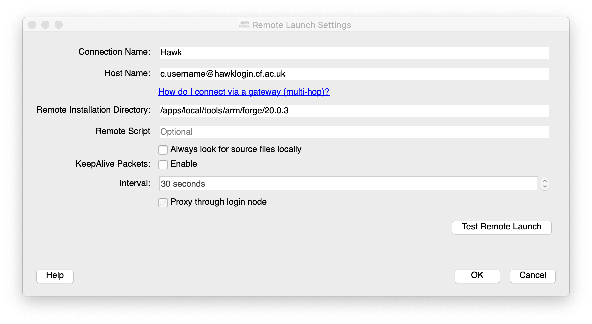
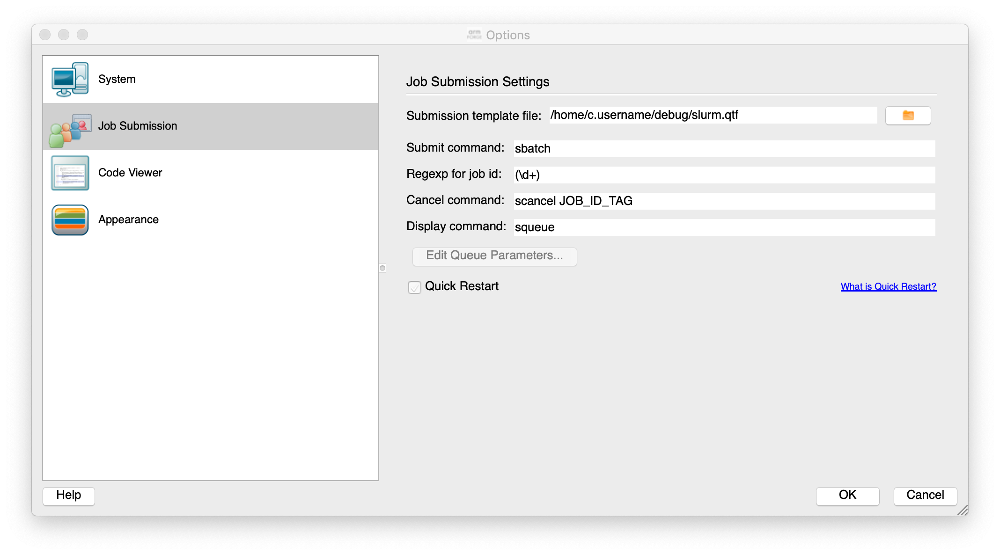

Bugs!  Software is very hard to write without them so skills to squash them is required.  For compiled languages, e.g.
C/C++/Fortran there
is much that can be done at compile-time to highlight issues, as well as at runtime.  For other languages, e.g. Python, issues are only highlighted at
runtime.  For HPC, highlighting issues at runtime can mean wasted resources.

> ## Bugs
> 
> Some examples of bugs are:
> * Unexpected error (Segmentation fault, crashes)
> * Different results (even crashes) on different systems or number of processors.
> * Change does more than it was supposed to do.
>
> Print statements can be useful but can take time, and adding code can change behaviour of the program and the bug can
> change or disappear.
{: .callout}

# Compiled languages

Most compilers have methods to detect issues at compile-time.  These are usually recommendations due to non-compliance
of standard or type conversion.  There is also options enabled at compile time to help debugging at runtime.

## GNU/GCC

GNU compilers have a number of options.  Using `gfortran` as an example (gcc and g++ share options).

To turn on debug symbols, adds line number of source file information:

~~~
$ gfortran -g main.f90
~~~
{: .language-bash}

To turn traceback to highlight where the program crashed.  Provides line number of source file.

~~~
$ gfortran -fbacktrace main.f90
~~~
{: .language-bash}

To force a strict standard compliance reduces issues due to compiler specific options being used that harms portability.

~~~
$ gfortran -std=f95 main.f90
~~~
{: .language-bash}

To strictly look for issues in code
~~~
$ gfortran -std=f95 -pedantic -Wall main.f90
~~~
{: .language-bash}

# Intel

Intel Compilers have similar options to GNU.  Using `ifort` as an example (most options shared between other compilers
`icc` and `icpc`.

To turn on debug symbols, adds line number of source file information:

~~~
$ ifort -g main.f90
~~~
{: .language-bash}

To turn traceback to highlight where the program crashed.  Provides line number of source file.

~~~
$ ifort -traceback main.f90
~~~
{: .language-bash}

To force a strict standard compliance reduces issues due to compiler specific options being used that harms portability.

~~~
$ ifort -std95 main.f90
~~~
{: .language-bash}

To strictly look for issues in code

~~~
$ ifort -C main.f90
~~~
{: .language-bash}

> ## Demonstration
> 
> Download the files
> 
> ~~~
> $ wget --recursive --no-parent {{ site.url }}{{ site.baseurl }}/files/debug1/Makefile
> $ wget --recursive --no-parent {{ site.url }}{{ site.baseurl }}/files/debug1/main.f90
> ~~~
> {: .language-bash}
> 
> Look at the `Makefile`, can you change the compilation options to turn on some of the compiler options.
> Update the time on `main.f90` with `touch main.f90` - run `make` again.
> Try switching compilers and see how debug options work.
> > ## Solution
> > The options should help identify issues.  Updating the file should rebuild the executable.  Just explore!
> {: .solution}
{: .challenge}

## System settings

There are a few settings that can control the behaviour when compiled languages are run these are set using the `ulimit`
option.

To set the limit of core dumps (files generated when a program crashes) use

~~~
$ ulimit -c unlimited
~~~
{: .language-bash}

To set the limit of the stack memory (important for Intel Fortran Compiler)

~~~
$ ulimit -s unlimited
~~~
{: .language-bash}

# Debuggers

There are a number of tools that can be used to look at problems at runtime for compiled codes such as `gdb` or ARM
Forge DDT.

## gdb

Compile with `-g` to include debug symbols. Then run

~~~
$ ifort -g main.f90
$ gdb ./a.out
(gdb) run
~~~
{: .language-bash}

[gdb](https://www.gnu.org/software/gdb/) can usually be found where GNU compilers are available.  It is very useful to
print out other variables near to where the program crashes. 

## ARM DDT

ARM DTT is a commercial debugger.  It is loaded with a module

~~~
$ module load arm-forge
~~~
{: .language-bash}

It is recommended to run the graphical debugger by installing the GUI interface on your local machine and connect remotely to
Hawk via the software.  A download from [ARM
website](https://developer.arm.com/tools-and-software/server-and-hpc/downloads/arm-forge) and look at the links in
*Remote Client Downloads*

After installing the client you can setup a connection to Hawk using standard SSH connections and pointing to the Hawk
location for the version of ARM Forge, e.g. `/apps/local/tools/arm/forge/20.0.3`

Options can be set for the job scheduler

The important file to make sure it works is the template job submission script file.  This is the file
`/home/c.username/debug/slurm.qtf` in the figure above and can be downloaded with

~~~
$ wget {{ site.url }}{{ site.baseurl }}/files/debug2/slurm.qtf
~~~
{: .language-bash}

This can then be run and will be submitted to the queue and will then connect back to your desktop to allow you to step
through the software.

If interested please get in touch if further help is required.

## Python debugger Pdb

Python is already good at providing information on errors. If the program is not providing the correct answers then
debugging would be useful.

The [Pdb](https://docs.python.org/3/library/pdb.html) module is very useful for tracking program flow in Python and printing out variables to check state of the
program.

Very similar to `gdb`.

To invoke Pdb, it can be applied to a Python script

~~~
$ python3 -m pdb myscript.py
~~~
{: .language-bash}

Or near a location that requires by inserting in the Python script

~~~
import pdb; pdb.set_trace()
~~~
{: .language-python}

> ## Demonstration
> 
> Download the files
> 
> ~~~
> $ wget --recursive --no-parent {{ site.url }}{{ site.baseurl }}/files/debug3/Makefile
> $ wget --recursive --no-parent {{ site.url }}{{ site.baseurl }}/files/debug3/main.f90
> $ wget --recursive --no-parent {{ site.url }}{{ site.baseurl }}/files/debug3/main.py
> ~~~
> {: .language-bash}
>
> Compile the program with `make`.  Try running inside a debugger.
> > ## Solution
> > Use `make` and `gdb` to explore the error.  Use `pdb` for Python.
> {: .solution}
{: .challenge}

## Working with job schedulers

When running a debugger it can either be interactive or non-interactive.  Interactive will require the job scheduler to
give you resource fairly quickly so a small example of the bug that requires small amount of resource will allow it to
queue less on Hawk.  The `dev` partition can be used for short running jobs.

SLURM can provide an interactive session with

~~~
$ srun -n 1 -p compute --account=scwXXXX --pty bash --login
~~~
{: .language-bash}

This will provide the user with a bash shell on the partition selected, e.g. `compute` in example above.

For non-interactive jobs, the debugger can be supplied with a script to print traceback or print a variable when it
crashes.  A core file can also be produced which contains a snapshot of memory at the point of crashing.

If software compiled with Intel compiler the following environment variable can be set in the job script before the program is run.

~~~
$ export decfort_dump_flag=y
~~~
{: .language-bash}

This will produce a core file `core.XXXX` where `XXXX` is the process id of the crashed program.

A debugger such as `gdb` can be run on a login node with the executable and core file.

~~~
$ gdb ./a.out core.XXXX
~~~
{: .language-bash}

> ## Demonstration
> 
> Download the files
> 
> ~~~
> $ wget --recursive --no-parent {{ site.url }}{{ site.baseurl }}/files/debug4/Makefile
> $ wget --recursive --no-parent {{ site.url }}{{ site.baseurl }}/files/debug4/main.f90
> ~~~
> {: .language-bash}
> 
> Look at the `Makefile`, can you check that the compilation options to turn on some of the compiler options.  See what
> happens when it is run.
>
> > ## Solution
> >
> > Set `decfort_dump_flag=y` to create a core file and run with `gdb ./a.out core.XXXX`
> {: .solution}
{: .challenge}

# Intel Inspector

[OpenMP](https://www.openmp.org) is a popular technique to parallelise code due to its simple method of using compiler
directives to guide the compiler.

> ## More information on OpenMP
>
> We provide training on OpenMP for users wanting further information on how to use it.  Please check recent training
> notices.
{: .callout}

The easy nature of adding OpenMP can also lead to common mistakes such as race conditions on threads reading and writing
to the same variable.  [Intel Inspector](https://software.intel.com/content/www/us/en/develop/tools/inspector.html)
checks the code for threading issues.  An example of it highlighting possible issues can be found in the [Github
issue](https://github.com/mrc-ide/covid-sim/issues/161) for the COVID-19 CovidSim microsimulation model developed by the
MRC Centre for Global Infectious Disease Analysis.

Intel Inspector can be loaded with the module `intel-psx`

~~~
$ module load intel-psx
~~~
{: .language-bash}

This loads the complete Intel Parallel Studio software suite.

Then the application, e.g. `my_app.exe`, you want to debug can be run with

~~~
$ inspxe-cl -collect ti2 -result-dir ./myResult1 -- my_app.exe
~~~
{: .language-bash}

This will output the collected data from the application in `myResult1` directory.  The `-collect` option can be varied
depending on what needs to be collected.  

~~~
$ inspxe-cl -collect-list
~~~
{: .language-bash}

~~~
Available analysis types:
    Name  Description
    mi1   Detect Leaks
    mi2   Detect Memory Problems
    mi3   Locate Memory Problems
    ti1   Detect Deadlocks
    ti2   Detect Deadlocks and Data Races
    ti3   Locate Deadlocks and Data Races
~~~
{: .output}

Intel Inspector is currently free at time of writing but it can be run remotely n Hawk.  Due to the GUI it is
recommended to request access to the VNC server (a more efficient method of running graphical windows from a remote
machine).

~~~
$ inspxe-gui
~~~
{: .language-bash}

And load the files generated from the collection stage.

If further information is required please get in touch.

# Summary

This has been a short introduction to debuggers and common methods to analyse and identify the bug to fix.



